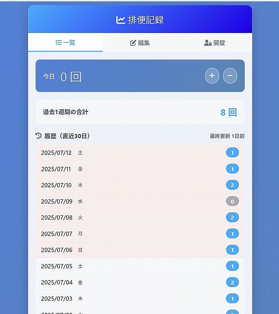

# 排便記録アプリ

💩 **排便回数を手軽に記録・管理できるシンプルなWebアプリです。**

## 概要

- 日々の排便回数をワンクリックで記録
- 過去30日分の履歴や、直近1週間の合計を自動集計
- CSV形式でデータを編集・保存可能
- オーナー認証（パスコード）による編集・記録ロック機能
- データはサーバー上のCSVファイルに保存されます

## 使い方

1. サーバーに `index.php` を設置します（PHPが動作する環境が必要です）。
2. ブラウザで `index.php` にアクセスします。
3. 「今日」の回数を「＋」「−」ボタンで記録できます。
4. 「編集」タブでCSVデータを直接編集・保存できます。
5. 「開錠」タブでパスコードを入力すると、記録・編集が可能になります。

### パスコード（オーナー認証）について

- パスコード（オーナー認証用）は、`index.php` の冒頭で定義されています。
- 初期値は `your-password` です。
- ご自身で任意のパスコードに書き換えてご利用ください。

```php
// === オーナーパスコード設定 ===
// ここでオーナー用のパスコード（半角英数字）を設定してください。
// 設置者は「your-password」を任意のパスワードに書き換えてください。
define('OWNER_PASSCODE', 'your-password');
// ============================
```

## 必要環境

- PHP 7.x 以上
- ファイル書き込み権限のあるWebサーバー

## ファイル構成

- `index.php` … アプリ本体
- `defecation_log.csv` … 記録データ（自動生成されます）

## スクリーンショット



## 注意事項

- データはサーバー上のCSVファイルに保存されます。バックアップは各自で行ってください。
- パスコードは初期値のまま運用しないことを推奨します。 